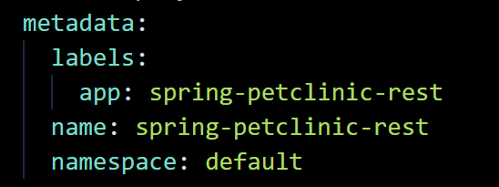
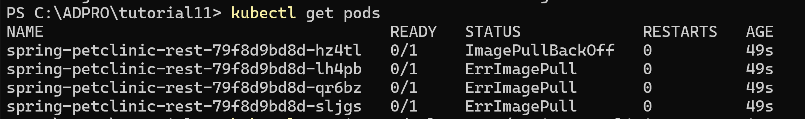

# Tutorial 11 (Kubernetes)

**Name**: Theodore Kevin Himawan

**NPM**: 2306210973

**Class**: ADPRO A

## Reflection on Hello Minikube
>1. Compare the application logs before and after you exposed it as a Service. Try to open the app several times while the proxy into the Service is running. What do you see in the logs? Does the number of logs increase each time you open the app?

Before the app is exposed as a service, the logs only show that the HTTP server is running on port 8080 and the UDP server on port 8081. When we expose the app as a service, we can access it from outside the Kubernetes cluster. After doing this and opening the app, the logs become bigger because the server logs every incoming HTTP request with a timestamp. Because of that, each time someone opens the app, a new HTTP request is sent, and the server logs it, causing the logs to increase.

>2. Notice that there are two versions of `kubectl get` invocation during this tutorial section. The first does not have any option, while the latter has `-n` option with value set to `kube-system`. What is the purpose of the `-n` option and why did the output not list the pods/services that you explicitly created?

The <code>-n</code> flag stands for namespace. The command <code>kubectl get pods, services -n kube-system</code> is used to list all pods and services within the <code>kube-system</code> namespace. Our earlier pods and services were created in a different namespace, more specifically the <code>default</code> namespace. That's why the ones we created earlier didn’t show up in the output of this command.

## Reflection on Rolling Update & Kubernetes Manifest File

>1. What is the difference between Rolling Update and Recreate deployment strategy?

The Rolling Update strategy updates pods gradually, replacing them one at a time while keeping the old ones running to ensure the application remains available during the process. In contrast, the Recreate strategy stops all existing pods first before launching new ones, which causes a temporary downtime while the update takes place.

>2. Try deploying the Spring Petclinic REST using Recreate deployment strategy and document your attempt.

- First, we change the `deployment.yaml` file. Change the strategy from RollingUpdate to Recreate.

- Next, we delete the metadata (because it will be automatically generated). Remove unnecessary fields such as Annotations, CreationTimestamp, Generation, ResourceVersion, and UID.

- Also, delete the status at the end of the `deployment.yaml` file.
- Apply the changes using this command:
    >kubectl apply -f deployment.yaml`
- I try to change the image version to a different one to test out the new deployment strategy.
- Because of the Recreate strategy, all the pods would be unavailable as they would be rebuilt. The old pods are deleted and new ones are made according to the changes in the image version. Here is the result:

>3.  Prepare different manifest files for executing Recreate deployment strategy.

It is on the file `recreate.yaml`

>4. What do you think are the benefits of using Kubernetes manifest files? Recall your experience in deploying the app manually and compare it to your experience when deploying the same app by applying the manifest files (i.e., invoking `kubectl apply -f` command) to the cluster.

Kubernetes manifest files let us describe how we want our app to run, and Kubernetes will make it happen. Instead of manually creating pods, services, or deployments, we just write down the desired setup in a yaml file. Then, we can use that file to easily deploy, update, or remove the app. This saves time, avoids manual work, and makes it easy to recreate the app in another cluster later on.

